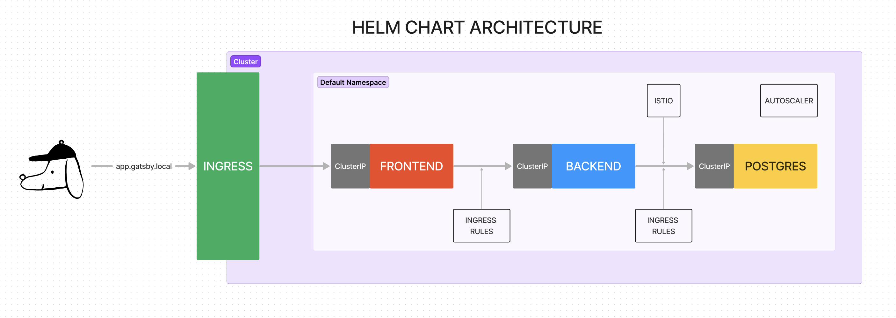

Software / System Requirements that I used

- minikube v1.32.0
- Kubernetes v1.28.3
- Docker 24.0.7
- Darwin 14.2.1 (arm64)
- Docker container (CPUs=2, Memory=7798MB)

Architecture Diagram


1. Add `127.0.0.1 app.gatsby.local` to your machine’s hosts file
    1. It will map your `localhost` IP address to both hostnames and makes them accessible when  `minikube tunnel` command is ran later on.
        
        ```
        ➜  helm git:(main) ✗ cat /etc/hosts
        ##
        # Host Database
        #
        # localhost is used to configure the loopback interface
        # when the system is booting.  Do not change this entry.
        ##
        127.0.0.1	localhost
        255.255.255.255	broadcasthost
        ::1             localhost
        # Added by Docker Desktop
        # To allow the same kube context to work on the host and the container:
        127.0.0.1 kubernetes.docker.internal
        # End of section
        127.0.0.1 app.gatsby.local # HERE IS THE CHANGE WE WANT
        ```
        
2. Start Minikube + Enable Ingress Addon
    
    ```bash
    minikube start
    minikube addons enable ingress
    ```
    
    1. Or you can Install NGINX Ingress Controller like this if you want? But go with the addon because i tested that one
        
        ```bash
        kubectl apply -f https://raw.githubusercontent.com/kubernetes/ingress-nginx/controller-v1.9.6/deploy/static/provider/cloud/deploy.yaml
        
        # If already installed
        # helm upgrade --install ingress-nginx ingress-nginx --repo https://kubernetes.github.io/ingress-nginx --namespace ingress-nginx --create-namespace
        ```
        
3. Create Secrets
    1. Source `.env`. It is provided with sensitive variables. In production, this would be in a Secrets Manager.
        
        ```
        set -a # automatically export all variables
        source .env
        set +a # stop automatically exporting
        ```
        
        (or just paste this into the terminal)
        
        ```bash
        HOST=app.gatsby.local # if this was a real DNS, i would insert the IP address, not the domain name
        KEY_FILE=private.key
        CERT_FILE=certificate.crt
        
        POSTGRES_USER=postgres
        POSTGRES_PASSWORD=postgres
        ```
        
    2. Create TLS Secrets `secret/certificate`
        
        ```bash
        openssl req -x509 -out ${CERT_FILE} -keyout ${KEY_FILE} \
        -newkey rsa:2048 -nodes -sha256 \
        -subj '/CN=${HOST}' -extensions EXT -config <( \
        printf "[dn]\nCN=${HOST}\n[req]\ndistinguished_name = dn\n[EXT]\nsubjectAltName=DNS:${HOST}\nkeyUsage=digitalSignature\nextendedKeyUsage=serverAuth")
        
        kubectl create secret tls certificate --key ${KEY_FILE} --cert ${CERT_FILE}
        ```
        
    3. Create Postgres Credential Secrets `secret/postgres-secret`
        
        ```bash
        kubectl create secret generic postgres-secret \
        --from-literal=postgresql-username=${POSTGRES_USER} \
        --from-literal=postgresql-password=${POSTGRES_PASSWORD}
        ```
        
4. Install Prometheus for Postgres Monitoring
    
    ```bash
    helm repo add prometheus-community https://prometheus-community.github.io/helm-charts
    helm repo update
    
    # Custom Resource Definitions (CRDs) for ServiceMonitor 
    LATEST=$(curl -s https://api.github.com/repos/prometheus-operator/prometheus-operator/releases/latest | jq -cr .tag_name)
    curl -sL "https://github.com/prometheus-operator/prometheus-operator/releases/download/${LATEST}/bundle.yaml" | kubectl create -f -
    
    helm upgrade --install postgres-exporter prometheus-community/prometheus-postgres-exporter \
    	--set config.datasource.host="postgres" \
    	--set config.datasource.userSecret.name="postgres-secret" \
    	--set config.datasource.userSecret.key="postgresql-username" \
    	--set config.datasource.passwordSecret.name="postgres-secret" \
    	--set config.datasource.passwordSecret.key="postgresql-password" \
      --set config.datasource.database="consensys" \
      --set serviceMonitor.enabled=true
    ```
    
5. Install Istio as Service Mesh for secure comm between BE and DB
    
    ```bash
    helm repo add istio https://istio-release.storage.googleapis.com/charts
    helm repo update
    
    kubectl label namespace default istio-injection=enabled
    
    helm upgrade --install istio-base istio/base -n istio-system --set defaultRevision=default --namespace istio-system --create-namespace
    helm upgrade --install istiod istio/istiod -n istio-system --wait
    ```
    
6. Run Helm Chart for the Web App
    
    ```bash
    helm upgrade --install webapp ./webapp
    ```
    
7. Start Minikube Tunnel
    
    ```bash
    minikube tunnel
    ```
    
8. Go to [`https://app.gatsby.local/`](https://app.gatsby.local/)